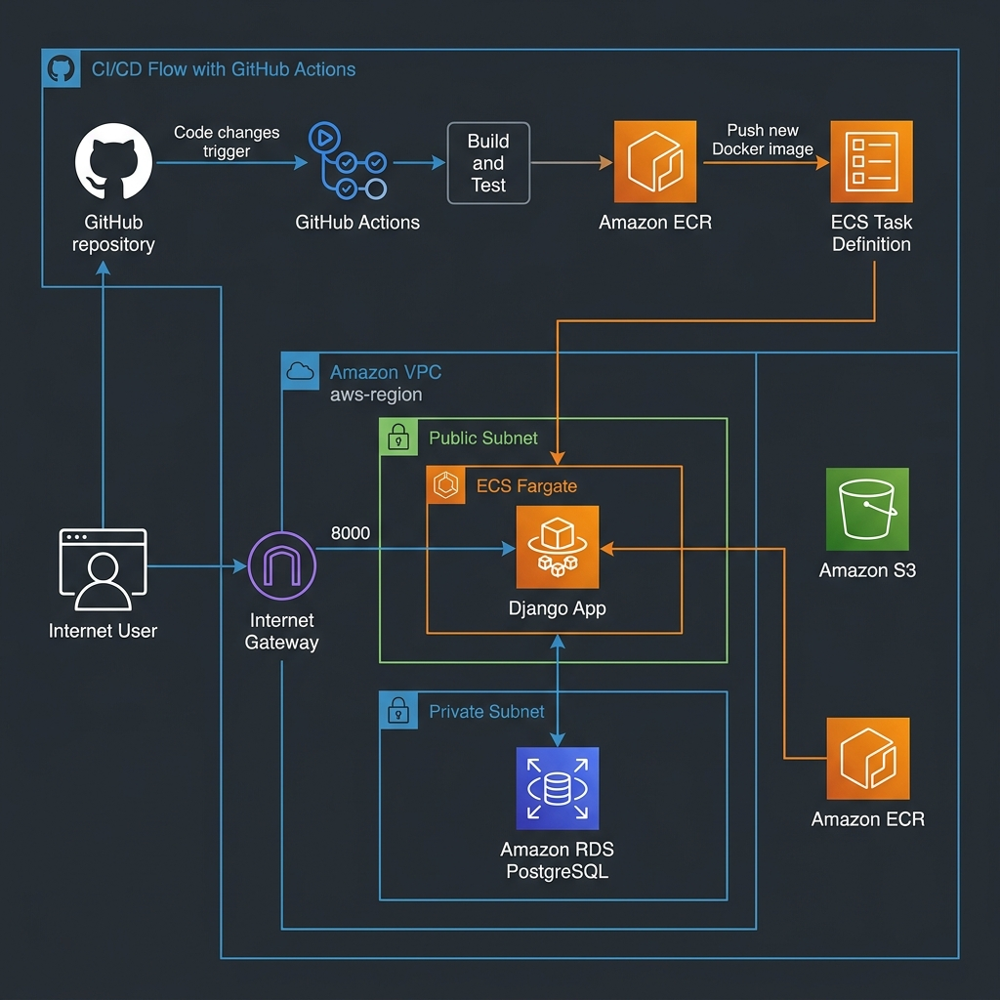

# 🚀 Triển khai Django trên AWS với Terraform & GitHub Actions

Dự án này cung cấp một quy trình tự động hóa hoàn chỉnh để triển khai ứng dụng web Django lên hạ tầng AWS sử dụng **ECS Fargate**, **RDS (PostgreSQL)**, và **Terraform**. Hệ thống được thiết kế theo tiêu chuẩn doanh nghiệp, đảm bảo tính bảo mật, khả năng mở rộng và quy trình CI/CD mượt mà.



## 🏗️ Kiến trúc Hệ thống (Architecture)

Hệ thống được xây dựng trên nền tảng AWS với các thành phần chính:

1.  **VPC & Networking**: Mạng lưới được chia thành Public Subnets (nơi container Django chạy và được truy cập trực tiếp qua Public IP trên cổng 8000) và Private Subnets (cho cơ sở dữ liệu) để tối ưu bảo mật. Việc không dùng ALB giúp đơn giản hóa hạ tầng và tiết kiệm chi phí cho các môi trường thử nghiệm.
2.  **AWS ECS Fargate**: Chạy các container Docker của Django mà không cần quản lý máy chủ EC2.
3.  **Amazon RDS (PostgreSQL)**: Cơ sở dữ liệu quan hệ được đặt trong khu vực riêng tư, chỉ cho phép kết nối từ ứng dụng.
4.  **Amazon ECR**: Kho lưu trữ Docker Images cho ứng dụng.
5.  **Amazon S3**: Lưu trữ các tệp tĩnh (static files) và tệp phương tiện (media files).
6.  **GitHub Actions**: Luồng CI/CD tự động build, push image và cập nhật dịch vụ ECS mỗi khi có code mới.

## 🛠️ Công nghệ Sử dụng (Tech Stack)

-   **Backend**: Python, Django
-   **Infrastructure as Code (IaC)**: Terraform
-   **Cloud Provider**: AWS (ECS, RDS, S3, ECR, VPC, IAM)
-   **CI/CD**: GitHub Actions
-   **Database**: PostgreSQL
-   **Containerization**: Docker

## 📂 Cấu trúc Thư mục

-   [`/app`](./app): Mã nguồn ứng dụng Django và Dockerfile.
-   [`/terraform`](./terraform): Các tệp cấu hình hạ tầng AWS.
-   [`.github/workflows`](./.github/workflows): Định nghĩa các luồng tự động hóa CI/CD.
-   [`/docs`](./docs): Hình ảnh và tài liệu bổ trợ.

## 🚀 Hướng dẫn Bắt đầu (Quick Start)

### 1. Cấu hình Terraform
Truy cập thư mục `terraform/`, cấu hình các biến trong `variables.tf` và chạy:
```bash
terraform init
terraform apply
```

### 2. Thiết lập CI/CD
Cấu hình các Secrets trên GitHub:
- `AWS_ACCESS_KEY_ID`
- `AWS_SECRET_ACCESS_KEY`
- `TF_API_TOKEN` (nếu dùng Terraform Cloud)

### 3. Triển khai
Mỗi khi bạn `push` code lên nhánh `main`, GitHub Actions sẽ tự động thực hiện:
1. Kiểm tra mã nguồn.
2. Build Docker Image.
3. Push lên Amazon ECR.
4. Cập nhật ECS Service để chạy phiên bản mới nhất.
