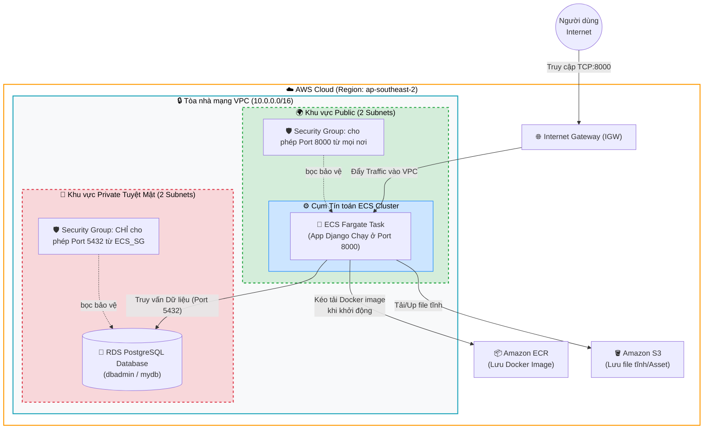

# Kiến trúc Hạ tầng Hệ thống trên AWS (Infrastructure Architecture)

Dựa trên toàn bộ mã nguồn Terraform của dự án, đây là bản thiết kế hệ thống chuyên nghiệp mô tả đường đi của mạng lưới, máy chủ ECS và cơ sở dữ liệu RDS của bạn.

## Sơ đồ Tổng quan Mạng (Network & Components)

## Giải thích Luồng Hoạt động (Workflows)

1. **Truy cập của Người dùng (Client Flow):**
   - Khách hàng trên mạng gõ địa chỉ IP Public của hệ thống kèm cổng `8000` (VD: `http://1.2.3.4:8000`).
   - Yêu cầu vượt qua cổng bảo vệ **Internet Gateway (IGW)** của AWS, đi qua lớp lọc **Security Group của ECS** và chạy thẳng vào nhân xử lý Code của Django App đang được "thầu" bởi máy chủ ECS Fargate.

2. **Cách App tương tác Dữ liệu (Backend Flow):**
   - Khi Django cần lôi dữ liệu ra (lấy User, Posts...), nó sẽ lấy thông số môi trường mà Terraform đã bơm sẵn, gọi xuyên qua tường lửa vào khu vực tuyệt mật (Private Subnet) để hỏi chuyện ổ cứng Database **PostgreSQL** ở cổng `5432`.
   - Vì khu vực Private này không nối với cổng IGW ra ngoài internet, Hacker không thể nào ping trực tiếp vào cục Database `mydb` của bạn được, chỉ có thằng App Django đứng kề bên nó mới được phép soi chiếu. Đây là độ bảo mật rất cao.

3. **Cơ chế Triển khai (CI/CD Flow):**
   - Khi bạn (Dev) đẩy tính năng mới lên GitHub -> GitHub Actions sẽ đóng gói nguyên khối Django App này và vứt nó lên kho lưu trữ **Amazon ECR** trên mây.
   - Thằng kho ECR lập tức gõ cửa báo cho cụm **ECS Fargate**, cụm ECS sẽ tắt máy cũ đi, qua kho ECR nhặt nguyên mẫu hộp image mới về bật lên chạy lại phục vụ phớt lờ máy cũ tự hủy. Quá trình triển khai không ngừng nghỉ.
